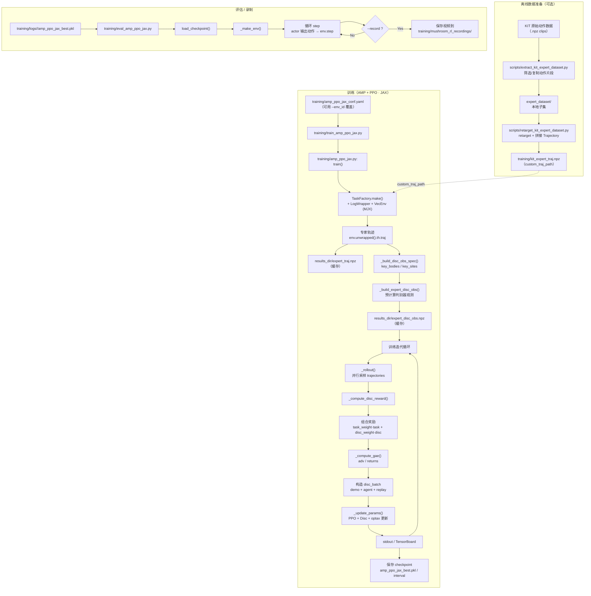
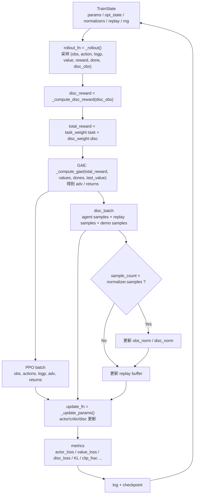

# 项目流程说明（SkeletonSteering）

本文件描述从数据与骨骼模型到 steering 任务训练、模型保存与评估的完整流程，并标注关键命令。

提示：本文件包含 Mermaid 代码块；在支持 Mermaid 的 Markdown 查看器（如 GitHub、VS Code + Mermaid 插件）中可直接渲染。若无法渲染，可参考后面的“纯文本备份”。

## 总览流程（Mermaid 流程框图）



## 总览流程（纯文本备份）

```
[骨骼模型]
    |
    v
[KIT 数据集] --> [重定向/插值/关节筛选] --> [专家轨迹缓存]
    |                                          |
    |                                          v
    |                                  expert_traj.npz
    |                                  expert_disc_obs.npz
    v
[steering 任务]  (SkeletonTorque.walk.mocap)   ★重点
    |
    v
[算法：AMP + PPO (JAX)]                        ★重点
    |
    v
[训练脚本] train_amp_ppo_jax.py                ★重点
    |
    v
[模型保存 + 日志] training/logs/<run>/
    |
    v
[评估] eval_amp_ppo_jax.py
```

## 训练内部循环（Mermaid）



## 关键组件与目录

- 骨骼模型
  - 基于 LocoMuJoCo 的 SkeletonTorque 相关模型与环境定义。
  - 主要运行依赖来自 `loco_mujoco`（conda env: `skeleton1.0.1`）。

- KIT 数据集
  - 原始/处理后的 KIT 运动数据位于 `expert_dataset/`。
  - 训练时会加载数据并进行重定向、插值与关节筛选。

- 专家轨迹缓存
  - `training/kit_expert_traj.npz`：KIT 轨迹的本地缓存（用于加速加载）。
  - 运行训练时会在 `training/logs/<run>/` 生成：
    - `expert_traj.npz`：当前环境加载并处理后的专家轨迹缓存。
    - `expert_disc_obs.npz`：按判别器观测配置预计算的特征缓存。

- Steering 任务（重点）
  - 任务定义位于 `training/steering_task.py`。
  - 训练环境 ID 典型为：`SkeletonTorque.walk.mocap`。
  - 任务目标：在指定速度区间内，跟随目标方向（steering）。

- 算法（重点）
  - `training/amp_ppo_jax.py`：JAX 版本 AMP + PPO 实现。
  - AMP：使用判别器对专家轨迹与策略轨迹进行区分。
  - PPO：作为策略优化主体，结合 AMP 奖励信号。

- 训练（重点）
  - 训练脚本：`training/train_amp_ppo_jax.py`
  - 配置文件：`training/amp_ppo_jax_conf.yaml`

## 训练命令（关键）

```
python training/train_amp_ppo_jax.py \
  --config training/amp_ppo_jax_conf.yaml \
  --env_id SkeletonTorque.walk.mocap \
  --seed 42
```

可复现性更强（但可能更慢）的配置示例：

```
# GPU + 尽量确定
python training/train_amp_ppo_jax.py \
  --config training/amp_ppo_jax_conf.yaml \
  --deterministic --seed 42

# CPU（更慢但更可复现）
python training/train_amp_ppo_jax.py \
  --config training/amp_ppo_jax_conf.yaml \
  --deterministic --jax_cpu --seed 42
```

## 模型保存与日志

- 训练输出位于：`training/logs/<run>/`
- 常见产物：
  - `amp_ppo_jax_best.pkl`：最佳模型权重。
  - `tensorboard/`：TensorBoard 事件文件。
  - `expert_traj.npz` / `expert_disc_obs.npz`：专家轨迹缓存。

## 评估命令（关键）

```
python training/eval_amp_ppo_jax.py \
  --model_path training/logs/<run>/amp_ppo_jax_best.pkl \
  --n_steps 2000 --deterministic
```

录制视频：

```
MUJOCO_GL=glfw python training/eval_amp_ppo_jax.py --record \
  --model_path training/logs/<run>/amp_ppo_jax_best.pkl
```

## 监控与可视化

- TensorBoard：

```
tensorboard --logdir training/logs
```

## 备注

- 若出现 NaN，通常来自环境数值爆炸或优化溢出；可开启 JAX NaN 调试并降低学习率/裁剪动作。
- steering 任务、AMP + PPO 算法与训练脚本是整个流程的核心路径。
